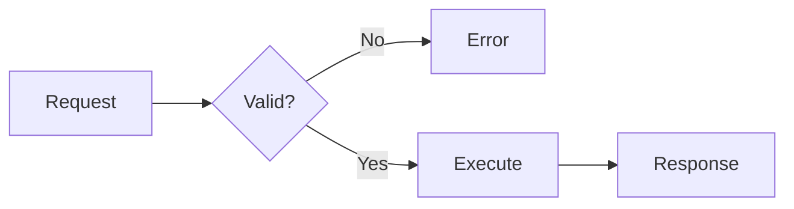

# Visual design

Use this reference when a lesson needs a figure, diagram, plot, animation, simulation, annotated trace, table, or generated illustration.

## Core rule

Every visual must serve a stated learning purpose. Do not add a visual only to decorate the page or make the lesson appear complete.

Before creating a visual, write:

```text
Learning objective:
Learner action:
Question the visual answers:
Representation:
What the learner should notice:
Accessible alternative:
Source or data:
```

If the visual does not improve explanation, prediction, practice, feedback, or assessment, use prose instead.

## Select the representation

Choose the form that matches the relationship the learner must inspect.

| Learning need | Preferred representation |
|---|---|
| Sequence or flow | Flowchart, timeline, sequence diagram, or step trace |
| State changes | State diagram, state table, or step-through simulation |
| Hierarchy or dependency | Tree, concept map, dependency graph, or outline |
| System interaction | Sequence diagram, architecture diagram, or message trace |
| Spatial structure | Labeled illustration, photograph, map, or SVG |
| Exact comparison | Table |
| Quantitative relationship | Plot or chart |
| Distribution | Histogram, density plot, box plot, or dot plot |
| Change over time | Line plot or timeline |
| Part-to-whole relationship | Stacked bar or carefully justified part-to-whole chart |
| Code execution | Annotated code, stack trace, memory diagram, or event trace |
| Parameter effect | Interactive plot or simulation |
| Classification | Matrix, decision tree, or sortable examples |
| Physical procedure | Labeled image, staged diagram, or video with transcript |

Use Mermaid for relationships and process structure. Use SVG when the learner must inspect or manipulate individual elements. Use Canvas only when SVG is impractical because of rendering scale or performance. Use a table when exact values matter more than visual pattern.

## Build visuals progressively

When a system contains several interacting parts, introduce one relationship at a time.

A useful sequence is:

1. Show the initial object or state.
2. Add the first relationship.
3. Ask what changes.
4. Add one component, edge, or state.
5. Preserve positions, names, and colors across figures.
6. Repeat until the complete model is visible.
7. Show the complete model again for synthesis.

Do not rearrange stable elements between steps unless movement is the concept being taught. Unnecessary movement forces the learner to reconstruct the diagram instead of following the new idea.

## Direct attention with signals

Use visual signals to identify the relevant element or organization:

- A short heading.
- An arrow or connector.
- A restrained highlight.
- Consistent color coding.
- A numbered step.
- A local label.
- A brief animation under learner control.

Research on multimedia signaling finds that cues can improve learning by directing attention to relevant material, while effects vary by learner, presentation, and study conditions.[^1]

Cue only the important element. If everything is emphasized, the signal carries no information.

## Apply coherence

Remove visual material that does not support the objective. Decorative images, unnecessary motion, background animation, and irrelevant facts compete with the material the learner must process.

A visual earns its place when it:

- Reveals a relationship that prose hides.
- Makes a process traceable.
- Supports a prediction.
- Allows meaningful manipulation.
- Presents data that the learner must interpret.
- Reduces search or memory load.

A stock photograph that only matches the topic does not satisfy this test.

## Keep words near what they describe

Place labels next to the relevant element. Place feedback next to the response or state that produced it. Synchronize narration or explanation with the visual step it describes.

Avoid:

- A distant legend for a small diagram.
- A paragraph that requires repeated scanning between prose and figure.
- Labels that use different terms from the lesson.
- An animation that completes before the explanation begins.

## Use stable visual language

Call each thing by one name. Give the same thing the same visual encoding across the lesson.

Maintain:

- Label text.
- Color meaning.
- Shape meaning.
- Line and arrow meaning.
- Direction of flow.
- Position when practical.
- Units and scales.

Do not use one color to mean `input` in one figure and `error` in another.

## Design captions

Introduce the figure before it appears. A caption should explain what[118;1:3u the learner should notice or how the figure supports the claim.

A useful caption can contain:

- The figure’s purpose.
- The decisive pattern or relationship.
- A source or adaptation note.
- A scale or model limitation.

Do not use the caption only to repeat the figure title.

## Design Mermaid diagrams

Use Mermaid for process, sequence, state, hierarchy, dependency, and relationship diagrams.

For every Mermaid diagram:

- Include `accTitle`.
- Include `accDescr`.
- Keep labels short.
- Use stable node identifiers.
- Avoid relying on color alone.
- Provide a prose or list equivalent for the important relationships.
- Check the rendered diagram at narrow widths.

Mermaid can add an accessible title and description to its generated SVG when the diagram author supplies `accTitle` and `accDescr`.[^2]

Example structure:



Do not assume that an accessible title and description replace a useful textual explanation for a complex diagram.

## Design SVG figures

Prefer SVG for interactive or annotated diagrams because individual elements can have structure, labels, focus behavior, and events.

For informative SVG:

- Use a meaningful accessible name.
- Add a description when the short name is insufficient.
- Use text elements for visible labels.
- Preserve a logical reading order.
- Make interactive elements keyboard reachable.
- Expose name, role, value, and state.
- Use visible focus styles.
- Keep hit targets large enough.
- Provide non-color indicators.

For complex data or relationships, include an adjacent textual explanation or table.

## Use Canvas carefully

Canvas pixels do not provide the semantic structure of ordinary HTML or SVG. Use Canvas only when necessary for performance, dense rendering, or a simulation that is impractical in SVG.

When Canvas is used:

- Provide equivalent controls in HTML.
- Provide an accessible name and instructions.
- Expose important state changes in text.
- Provide a textual or tabular equivalent of the result.
- Ensure keyboard operation.
- Avoid requiring precise pointer movement.
- Preserve a static fallback when practical.

Do not put essential instructions or assessment evidence only inside Canvas.

## Design plots and charts

Start with the question the learner must answer. Select the simplest chart that reveals the relationship.

For every plot:

- Label axes and units.
- Use meaningful tick values.
- State the data range.
- Show uncertainty when it affects interpretation.
- Avoid a truncated axis when it distorts comparison.
- Use direct labels when practical.
- Use patterns, markers, text, or line styles in addition to color.
- Provide the underlying values or a summary table when practical.
- Cite the data source and transformations.

Ask the learner to inspect or predict a pattern before explaining it when the objective involves interpretation.

## Design tables

Use a table for exact lookup or comparison.

A table must have:

- A clear caption when context is not already explicit.
- Header cells with correct scope.
- Units in headers.
- Consistent precision.
- A logical reading order.
- No color-only meaning.

Do not use a table only to position page content.

## Design code and execution traces

When teaching code behavior, show the relationship between source code and state.

Useful representations include:

- Line-numbered code with one highlighted step.
- A call stack.
- Variable or memory state.
- Queue contents.
- Input and output.
- A timeline of events.

Advance one execution step at a time. Preserve previous state when the learner needs to compare it. State what changed and why.

Do not animate faster than the learner can inspect. Provide pause, previous, next, and reset controls.

## Design simulations

A simulation must make a causal relationship inspectable.

Define:

- Inputs the learner can change.
- The model that maps inputs to outputs.
- Valid ranges and units.
- Initial values.
- Observable outputs.
- The prediction prompt.
- Feedback or explanation.
- Reset behavior.
- Model limitations.

Do not present a simulation as the real system when it omits consequential behavior. State whether it is illustrative, approximate, or based on measured data.

## Use generated illustrations

Use a generated image when a custom spatial or conceptual illustration helps and a diagram or sourced image is not better.

The prompt should specify:

- Learning purpose.
- Required objects and relationships.
- Viewpoint and composition.
- Labels that will be added later in HTML or SVG when exact text matters.
- Style, contrast, and background.
- Elements to omit.
- Whether the image is schematic or to scale.

Do not rely on generated images for exact text, measurements, interfaces, historical evidence, or scientific detail without verification.

## Support prediction and comparison

A visual activity is stronger when the learner acts before the explanation.

Possible actions:

- Predict the next state.
- Mark the path a request follows.
- Select the variable that controls the result.
- Arrange stages.
- Compare two implementations.
- Locate an error.
- Adjust a parameter and explain the change.

After the action, show the result and explain the mechanism. Do not reveal the answer through the initial highlight or default selection.

## Meet accessibility requirements

WCAG 2.2 requires text alternatives for non-text content and prohibits relying on sensory characteristics or color alone for instructions and meaning.[^3]

For every meaningful visual:

- Provide an accessible name.
- Provide enough text to convey the learning purpose.
- Keep information available without color.
- Maintain sufficient contrast.
- Preserve reading and focus order.
- Support zoom and reflow where the representation permits it.
- Avoid flashing.
- Respect reduced-motion preferences.
- Provide keyboard alternatives for pointer interaction.

See `accessibility.md` for the full interaction and testing requirements.

## Source and license visuals

For copied or adapted visuals:

- Verify the license.
- Attribute the creator and source.
- State whether the visual is reproduced or adapted.
- Preserve required notices.
- Cite the data or model.

For a newly generated plot, cite the underlying data and state the calculation or transformation.

## Visual verification checklist

Before delivery, verify:

- The visual supports an objective.
- The learner knows what to inspect or do.
- The chosen representation matches the relationship.
- Stable elements remain stable across progressive figures.
- Signals guide attention without overwhelming the page.
- Labels use lesson terminology.
- Axes, units, scales, and uncertainty are correct.
- The caption explains what matters.
- Source and adaptation information is present.
- The visual has an accessible alternative.
- Color is not the only carrier of meaning.
- Keyboard and non-drag controls exist when needed.
- Motion can be paused or avoided.
- The visual remains usable at narrow widths and high zoom.

## Sources

[^1]: David Alpizar, Olusola O. Adesope, and Rachel M. Wong, “A meta-analysis of signaling principle in multimedia learning environments,” *Educational Technology Research and Development* 68 (2020): 2095–2119. https://doi.org/10.1007/s11423-020-09748-7

[^2]: Mermaid, “Accessibility Options.” https://mermaid.ai/open-source/config/accessibility.html

[^3]: World Wide Web Consortium, *Web Content Accessibility Guidelines 2.2*, Success Criteria 1.1.1, 1.3.3, and 1.4.1. https://www.w3.org/TR/WCAG22/

